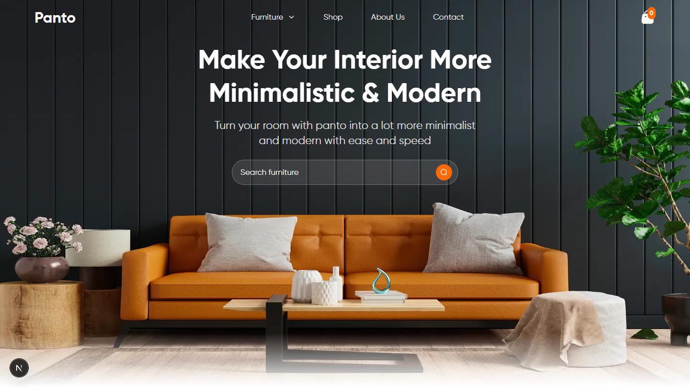

# Panto – Interior Design Landing Page

Panto is a modern, responsive landing page for an interior design brand. It showcases minimalist furniture with a sleek, full-screen hero section, search functionality, and a clean UI built with React, Next.js, and Tailwind CSS.

> _Turn your room with Panto into a lot more minimalist and modern with ease and speed.

## Demo Preview



## Live Demo

Check it out live here:  
🔗 [https://panto-pied.vercel.app](https://panto-pied.vercel.app)


## Features

- Fully responsive layout (mobile-first)
- Clean, minimalistic UI
- Optimized background image using `next/image`
- Light-themed design with modern accent colors
- Search input with Lucide icon integration
- Fast performance with server-side rendering

---

## Built With

- [Next.js](https://nextjs.org/) – React framework for production
- [React](https://reactjs.org/) – JavaScript UI library
- [Tailwind CSS](https://tailwindcss.com/) – Utility-first CSS framework
- [Lucide Icons](https://lucide.dev/) – Icon library for clean SVG icons

## 📦 Installation & Setup

```bash
# 1. Clone the repository
git clone https://github.com/your-username/panto-landing-page.git
cd panto-landing-page

# 2. Install dependencies
npm install

# 3. Run the development server
npm run dev

# 4. Open in your browser:
http://localhost:3000

🤝 Contributing

Pull requests are welcome! To contribute:

Fork the repository

Create a new branch: git checkout -b feature/YourFeature

Make your changes

Commit: git commit -m 'Add your feature'

Push: git push origin feature/YourFeature

Submit a Pull Request


📄 License

This project is open source and available under the MIT License